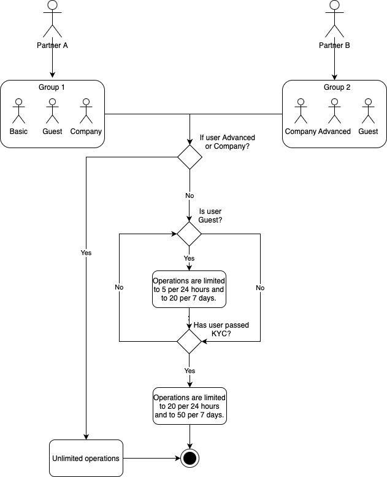

# About System X

System X provides identity verification services to verification providers. Each provider may want to request its users to confirm their identity.

# How it works

Each partner (provider) may have one or more users. Users are unique to each partner, meaning two different partners cannot provide services to the same user.

## Roles and users

Different partners may have the same functionality available to them. Permissions and methods, however, are configured independently for each partner, depending on the requirements and billing plans.

System X provides the following user types:

- **Guest**. All sessions are limited to 20 minutes; users with this type cannot perform more than 5 operations per 24 hours and 20 operations per 7 days. Once exceeded, the user goes into the `Idle` state.
- **Basic**. Available upon completing KYC, which extends limits to 20 operations per 24 hours and 50 operations per 7 days.
- **Company**. The number of operations is not limited.
- **Advanced**. The number of operations is not limited.

## Transition

Each user can be assigned a different type, depending on certain conditions. Possible transitions are:

- Guest → Basic → Advanced
- Advanced →  Basic → Guest
- Company → Advanced
- Advanced → Company
